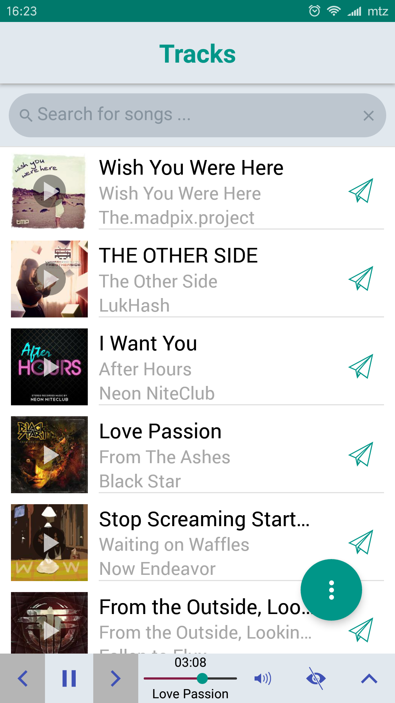
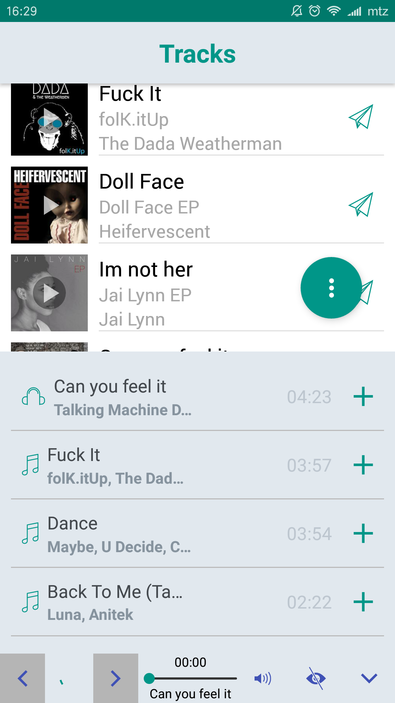
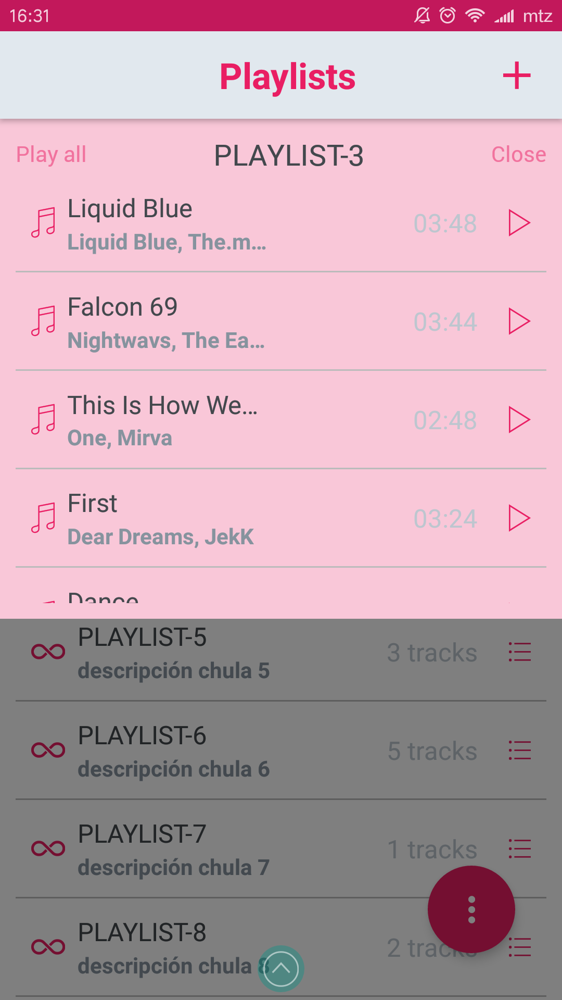
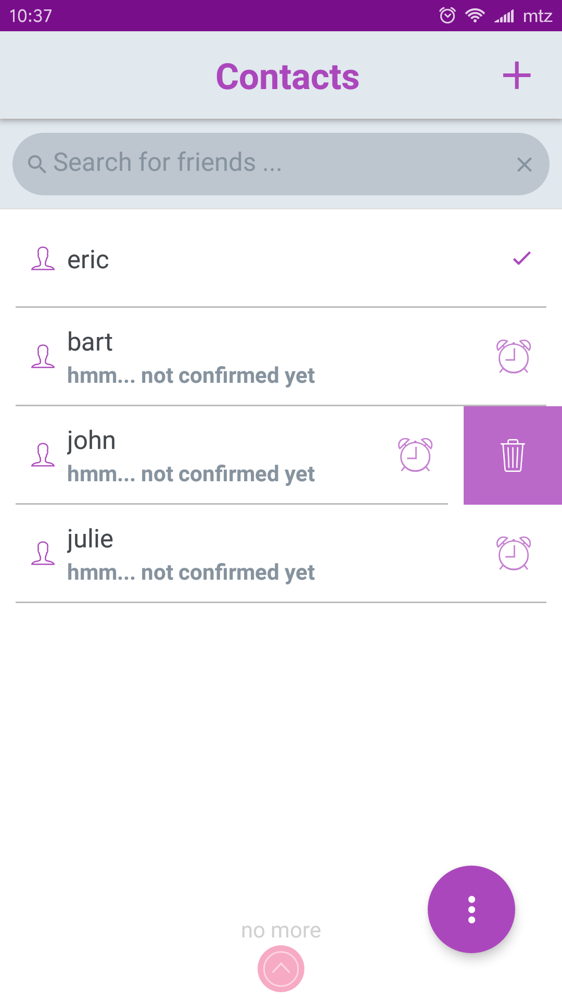

[](http://www.skylabcoders.com/)


## WAVE MY BEAT ~ mobile app.

Te gusta la música, te gusta compartir? Bienvenido, esta es una app ti, con la que puedes descubrir nuevos talentos a través de [Jamendo][jamendo], un servicio gratuito de música, y compartirlo con tus contactos a través de la misma app.

La app se ha realizado usando React Native, con un [back-end en node.js y mongoDb][wavetronic-api] como base de datos.

La app nos permite inspeccionar las canciones y albumes de Jamendo, crear/borrar playlist propias, añadir/borrar canciones a nuestras playlist, contactar con amigos registrados y finalmente enviar canciones a nuestros contactos verificados.

### INSTALACION DEL PROYECTO

Para instalar este proyecto:

```bash
    $ git clone https://github.com/mtzfactory/wavetronic-mobile.git
    $ cd wavetronic-mobile
    $ yarn install
    $ yarn run start
```

En caso que inicieis un proyeto nuevo, se deben seguir los siguientes pasos previos:

Una vez instaladas las dependencias, se tiene que ejecutar '_react-native link_' para registar los diversos complementos nativos que se utilizan en los proyectos de Andoid e iOs.

En caso que se hayan borrado las carpetas _android_ e _ios_, se debe hacer ejecutar primero '_react-native eject_' y luego seguir las instrucciones para registrar el complemento de [Firebase][firebase] en el proyecto de _android_ e _ios_.

### GENERANDO APK FIRMADO

En el caso de Android, los pasos a seguir para tener una versión definitva se detallan en el siguiente enlace:

https://facebook.github.io/react-native/docs/signed-apk-android.html

### ICON

Para generar los iconos de la app, tanto Android como iOs, se ha utilizado la siguiente utilidad:

https://medium.com/bam-tech/generate-your-react-native-app-icons-in-a-single-command-line-145af2e329b2

### CAPTURAS






[jamendo]: http://wwww.jamendo.com
[wavetronic-api]: https://github.com/mtzfactory/wavetronic-api
[firebase]: https://github.com/evollu/react-native-fcm